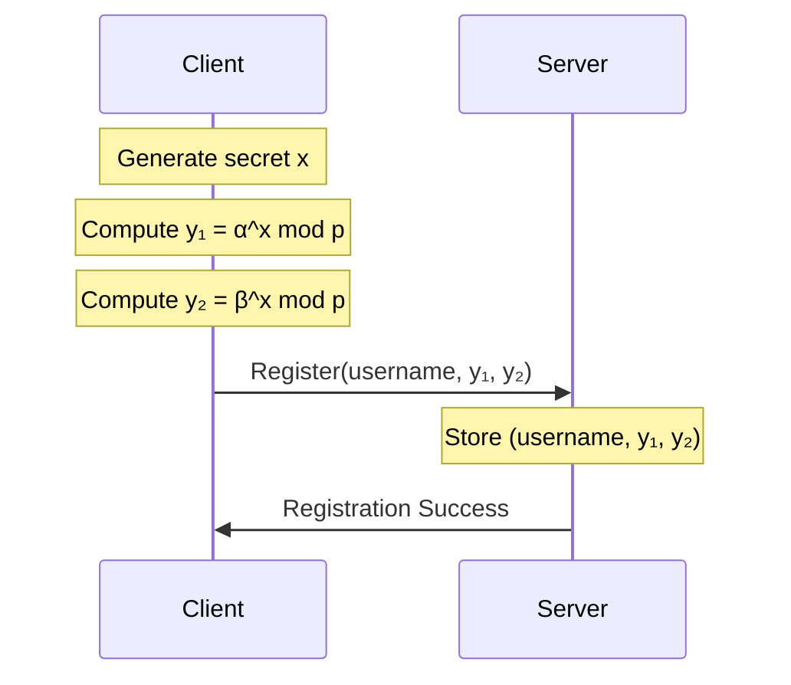
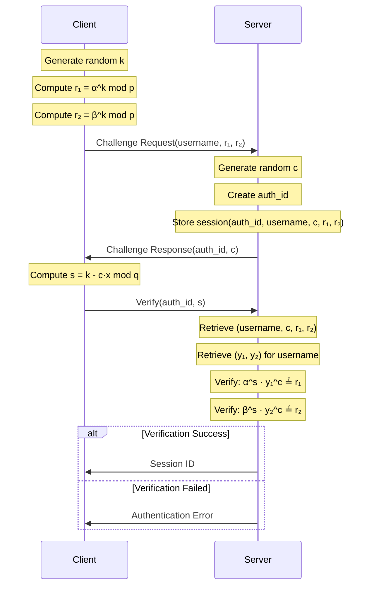
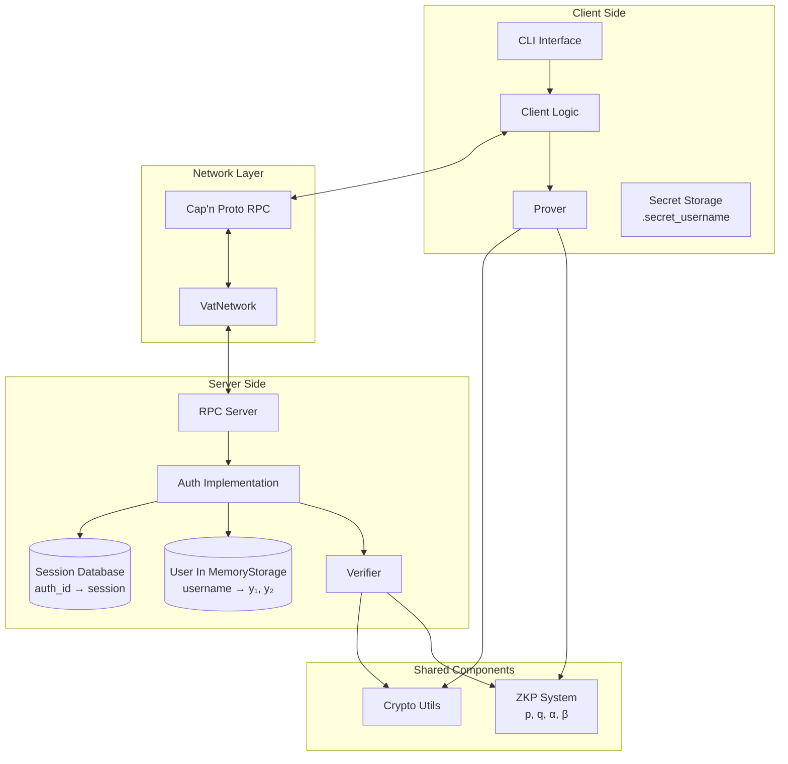
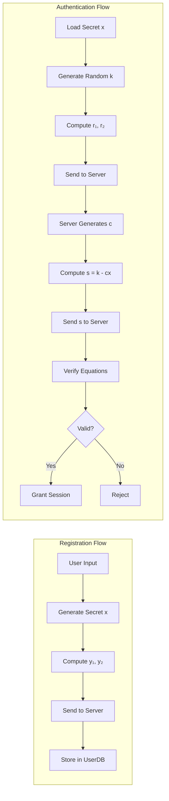

# Chaum-Pedersen Zero-Knowledge Proof Authentication

Code above is an implementation of the secure client-server authentication protocol Chaum-Pedersen ZK Proof using the Cap'n Proto RPC protocol.

## Table of Contents

- [Overview](#overview)
- [Mathematical Foundation](#mathematical-foundation)
- [Protocol Flow](#protocol-flow)
- [Architecture](#architecture)
- [Usage](#usage)
- [Security Analysis](#security-analysis)


### Key Features

- **Zero-Knowledge Authentication**: Prove knowledge without revealing secrets
- **Cap'n Proto RPC**: High-performance, schema-based RPC communication

## Mathematical Foundation

### Discrete Logarithm Problem

The security of the Chaum-Pedersen protocol relies on the computational hardness of the discrete logarithm problem in a cyclic group.

**Given**: A cyclic group G of prime order q, with generators α and β, and values y₁ and y₂
**Problem**: Find x such that y₁ = α^x mod p and y₂ = β^x mod p

### Protocol Parameters

- **p**: Large prime number (1024-bit in this implementation)
- **q**: Prime order of the cyclic group, where q | (p-1)
- **α**: Generator of the cyclic group of order q
- **β**: Another generator of the same cyclic group
- **x**: Secret value known only to the prover (user)

### Mathematical Operations

All exponentiations are performed modulo p, and all additions/subtractions in exponents are modulo q.

## Protocol Flow

### Registration Phase



**Mathematical Steps**:
1. Client generates random secret: `x ∈ Zq` (where Zq = {0, 1, ..., q-1})
2. Client computes public values:
   - `y₁ = α^x mod p`
   - `y₂ = β^x mod p`
3. Client sends `(username, y₁, y₂)` to server
4. Server stores the mapping: `username → (y₁, y₂)`

**Security Property**: The server learns y₁ and y₂ but cannot feasibly compute x due to the discrete logarithm problem.

### Authentication Phase



**Mathematical Steps**:

**Step 1: Commitment**
- Client generates random `k ∈ Zq`
- Client computes commitments:
  - `r₁ = α^k mod p`
  - `r₂ = β^k mod p`
- Client sends `(username, r₁, r₂)` to server

**Step 2: Challenge**
- Server generates random challenge `c ∈ Zq`
- Server creates unique `auth_id` for this session
- Server stores `(auth_id, username, c, r₁, r₂)`
- Server sends `(auth_id, c)` to client

**Step 3: Response**
- Client computes response: `s = k - c·x mod q`
- Client sends `(auth_id, s)` to server

**Step 4: Verification**
- Server retrieves session data using `auth_id`
- Server retrieves `(y₁, y₂)` for the username
- Server verifies both equations:
  - `α^s · y₁^c ≟ r₁ mod p`
  - `β^s · y₂^c ≟ r₂ mod p`

**Verification Proof**:
```
α^s · y₁^c = α^(k - c·x) · (α^x)^c
           = α^(k - c·x) · α^(c·x)
           = α^k
           = r₁

β^s · y₂^c = β^(k - c·x) · (β^x)^c
           = β^(k - c·x) · β^(c·x)
           = β^k
           = r₂
```

If both equations hold, the server is convinced that the client knows x without ever learning x.

## Architecture

### System Architecture



### Component Interaction Flow




## Cap'n Proto Schema

```capnp
struct RegisterRequest {
    user @0 :Text;
    y1 @1 :Data;
    y2 @2 :Data;
}

struct AuthenticationChallengeRequest {
    user @0 :Text;
    r1 @1 :Data;
    r2 @2 :Data;
}

struct AuthenticationChallengeResponse {
    authId @0 :Text;
    c @1 :Data;
}

struct AuthenticationAnswerRequest {
    authId @0 :Text;
    s @1 :Data;
}

struct AuthenticationAnswerResponse {
    sessionId @0 :Text;
}
```


## Usage

### Building the Project

```bash

cargo build --release
```

### Running the Server

```bash
cargo run -- server
```

### Client Operations

#### 1. Register and Login (Default)

```bash
cargo run -- client alice
```

Output:
```
Generated and saved secret for user 'alice'

=== Registration ===
Registering user 'alice'...
✓ Registration successful for user 'alice'

=== Authentication ===
Requesting authentication challenge for 'alice'...
✓ Received challenge (auth_id: xyz123...)
Sending authentication response...
✓ Authentication successful!
Session ID: abc456...
```

#### 2. Register Only

```bash
cargo run -- client bob register
```

Output:
```
Generated and saved secret for user 'bob'

=== Registration ===
Registering user 'bob'...
✓ Registration successful for user 'bob'
```

#### 3. Login Only

```bash
cargo run -- client alice login
```

Output:
```
Loading existing secret for user 'alice'

=== Authentication ===
Requesting authentication challenge for 'alice'...
✓ Received challenge (auth_id: xyz789...)
Sending authentication response...
✓ Authentication successful!
Session ID: def789...
```

### Command-Line Reference

```
Usage:
  Server: chaum_pedersen_auth server
  Client: chaum_pedersen_auth client <username> [register|login]
          If action is omitted, both register and login will be performed.
```

**Arguments**:
- `server`: Start the authentication server
- `client <username> [action]`: Run client with specified username
  - `register`: Register new user only
  - `login`: Authenticate existing user only
  - (omitted): Perform both registration and authentication

### Security Properties

#### 1. Zero-Knowledge

The protocol is zero-knowledge: the server learns nothing about the secret x beyond the fact that the client knows it.

**Proof Sketch**: The server only sees (y₁, y₂, r₁, r₂, s). A simulator could generate transcripts indistinguishable from real ones without knowing x.

#### 2. Soundness

A malicious client without knowledge of x cannot convince the server except with negligible probability.

**Proof Sketch**: For the verification equations to hold with random c, the client must know x such that y₁ = α^x and y₂ = β^x.

#### 3. Completeness

An honest client with knowledge of x will always successfully authenticate.

**Proof**: The verification equations hold by construction (shown in the mathematical proof above).

### Security Parameters

- **Prime size (p)**: 1024 bits
- **Group order (q)**: 256 bits (approximately)
- **Challenge size (c)**: 256 bits
- **Random k**: 256 bits

### Build Dependencies

- **capnpc** (0.19): Cap'n Proto compiler for Rust

